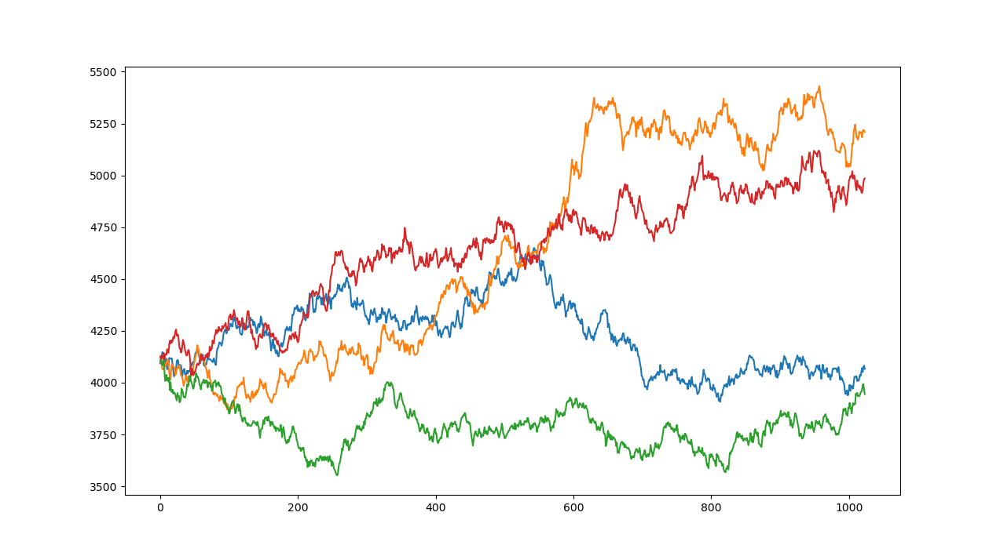
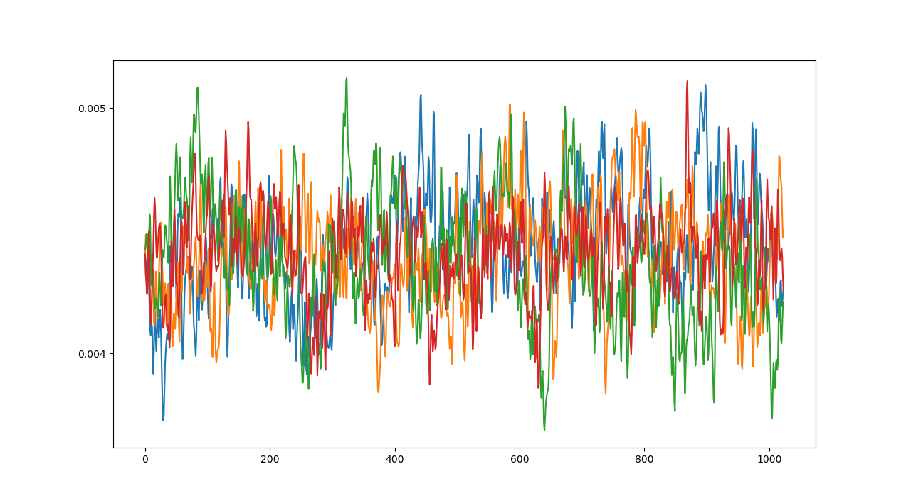

# Fractional Brownian Time Series

A Fractional Brownian Time Series Generator in Python for both long-range (Hurst > 0.5) and short-range (Hurst < 0.5 anti-) correlations. They are brought together at last in a Fractional Heston Generator that fuses rough volatility with persistent-momentum price increments using the *same* source of randomness, thus exhibiting the [Zumbach effect](https://bouchaud.substack.com/p/volatility-and-time-reversal-asymmetry). 

## Up, in a Straight Line

There was a time when equity indices couldn't be crystal-balled. When the legions of BtD'ers didn't show up en masse to teach the rose-tinted glassless a lesson whenever prices looked shaky. When being contrarian was only agony and not career harakiri. Before 20% on the S&P was reliable thinking and Goldman started getting its forecasts right. In those times there was a need to price risk and you'd ask your confusion of quantitative banalysts to run some simulations. 

So they would peg the server, running untold 'calibrations' against a single run of the S&P. Over and over until the S&P has completely surrendered, because learning a system requires lots and lots of examples; just don't forget to discredit half of the results to poor generalizability. 

But as [Professor Geman](https://en.wikipedia.org/wiki/Donald_Geman) would always say, the real challenge is in learning not as $n \rightarrow \infty$ but as $n \rightarrow 1$. The *transfer learning* paradigm, resurgent with the rise to power of LLMs, is a sheepish nod in this direction: we generate a lot of novel but plausible data, learn the underlying mechanisms and apply the model in a single shot to the real data. 

## Sleight of Rand(0,1)

All we've done however is shift the liability: Sure, we weren't confident in our generalizability before, but are we any more confident now that our synthetic data plausibly describes the real stuff? Is it power-law distributed, long-range correlated, volatility-clustered? Does fear go down when prices go up? Does it obfuscate mid-frequency mean-reverting drifts we can structure neutral portfolios around?

Your quant proudly presents his synthetic index prices:

You are right to feel concerned; these are Geometric Brownian trajectories and easy to generate but exhibit none of the features above. They just don't *look* right, but Masters in Financial Engineering grads aren't the most trenchant sanity checkers. 

One approach is to go bottom-up: model in gory detail the interaction between order arrivals, cancelations and spread-crossing trades with some queue length dependency and a bit of Hawkes excitement thrown in. With luck, just as statistical mechanics zooms out to give thermodynamics, we might also get some reasonable mean-field consequences like the [square-root impact law](https://bouchaud.substack.com/p/the-square-root-law-of-market-impact). 

Or we could be a lot lazier and spend some time at the riverside: plonk a drop of ink in the gravel shallows and measure the pigment distribution downstream. On a micro level those particles are caught up in eddies, fissures and backwaters but on a macro level the plume created looks awfully power-lawful. That's consistent with thinking of those particles as having *fractional* Brownian trajectories. 

## Jaber the Quant

The problem with this microstructural dodge is that it's like a shortcut across a ravine: fractional Brownian motion (fBm) is quite difficult to generate. Fortunately there is a nifty little technique developed by [Abi Jaber](https://www.tandfonline.com/doi/abs/10.1080/14697688.2019.1615113) that efficiently builds a short-range (Hurst < 0.5) fractional process as a superposition of multiscale Ornstein-Uhlenbeck processes. In the script `FractionalKernel.py` we also employ the small optimization described by [Rosenbaum & Zhang](https://www.risk.net/cutting-edge/7954656/deep-calibration-of-the-quadratic-rough-heston-model) that enhances power-law kernel quadrature accuracy. 

Gatheral famously claimed [volatility is rough](https://www.tandfonline.com/doi/full/10.1080/14697688.2017.1393551). While there is a [convincing argument](https://link.springer.com/article/10.1007/s13571-024-00322-2) that a simpler Gaussian volatility may do the job just as effectively, a short-range (anti-) correlated random series is useful not just as a potential volatility but also as a mid-frequency mean-reverting drfit. Here are some example fractional Brownian trajectories with `H = 0.2`:

## Long Ranger

Short-range memory is all well and good for volatility but it won't offer up the kind of high-momentum, up-in-a-straight-line trajectories we've seen since interest rates cratered. Generating `H > 0.5` fractional Brownian trajectories is more computationally intensive, but does have its heros. We use method #2 from [Dzhaparidze & van Zanten](https://link.springer.com/article/10.1007/s00440-003-0310-2) in `Dzhaparidze.py` where parameter `T` allows for a truncation of higher frequencies for efficiency. 

## It's not the Journey, it's the Hestonation

We put together a short-range volatility with long-range price increments in `FractionalHeston.py`. Crucially, the source of the randomness is the *same*, just as in [Rosenbaum & Zhang](https://www.risk.net/cutting-edge/7954656/deep-calibration-of-the-quadratic-rough-heston-model), which is not only parsimonious but reflects the negative correlation between changes in equity indices and their volatilities, witnessed in measures like the VIX. We veer from Rosenbaum's prescription only in that for greater parsimony our vol-of-vol Heston term is exponential, not quadratic. 

Shown here are some example fractional Heston trajectories with price-increment `H = 0.6`.  Long-range memory in the price series is evident, which appear to resemble more assuredly the plots we spend our days poring over. Or at least allowing us to price risk more robustly. Similar trajectories were generated for the Zero-Delay Filtering exercise [here](https://github.com/gcbeck/zdf). 

